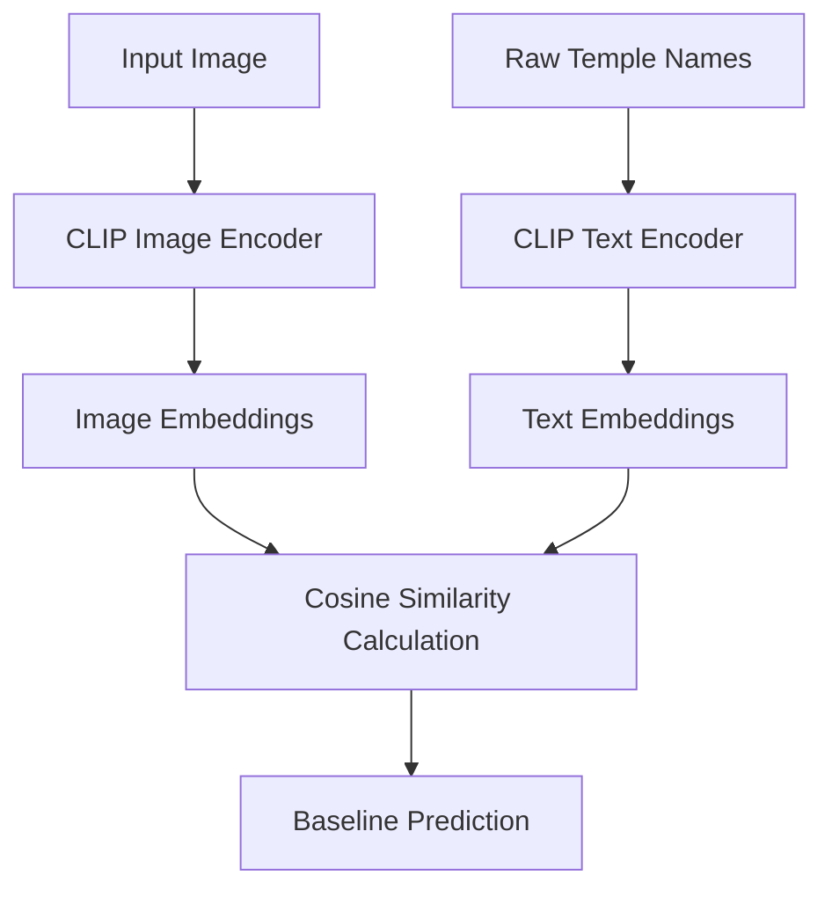
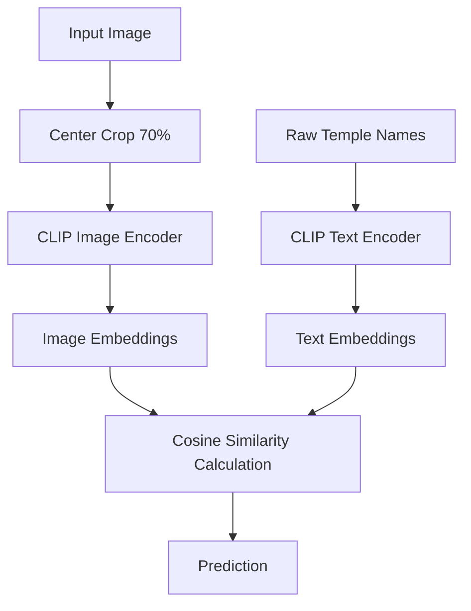
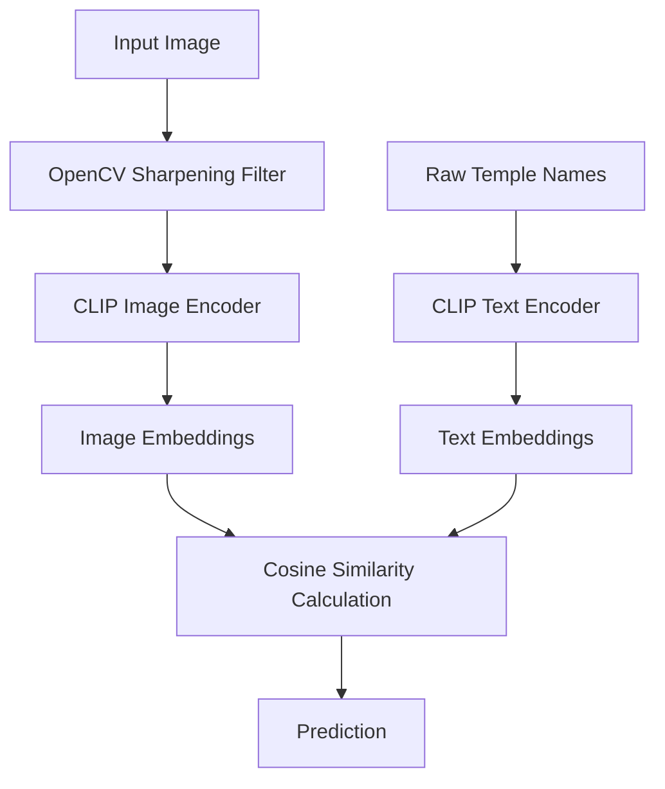
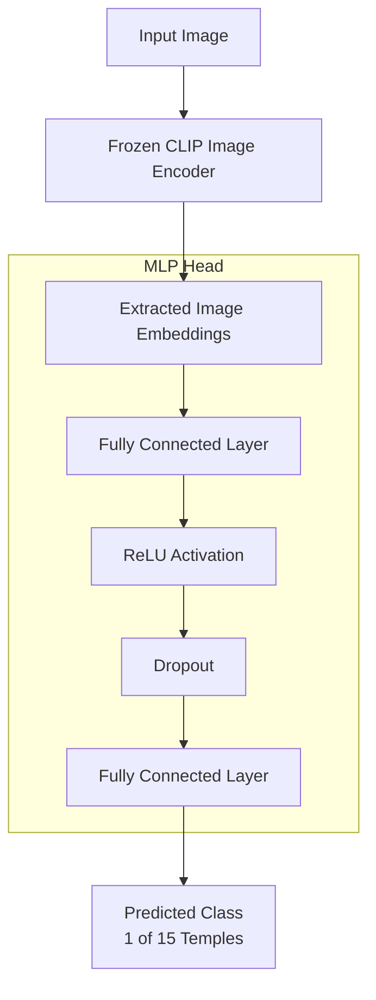

# Tamil Nadu Temple Detection - Methodologies

This document contains flowcharts visualizing the 5 different inference methodologies used in the project, as described in the project report.

## V1: Baseline Zero-Shot Classification

This method directly passes the raw temple names as text queries to the CLIP model to compare with the image embeddings.



## V2: Prompt Engineering

This approach enhances the text input by providing a structured prompt to give the CLIP model better context about the image.

```mermaid
flowchart TD
    %% Inputs
    I[Input Image] --> CIE[CLIP Image Encoder]
    T[Raw Temple Names] --> PE[Prompt Engineering\n"A majestic photo of the [Name]..."]
    PE --> CTE[CLIP Text Encoder]
    
    %% Encoders
    CIE --> IE[Image Embeddings]
    CTE --> TE[Text Embeddings]
    
    %% Comparison
    IE --> SIM[Cosine Similarity Calculation]
    TE --> SIM
    
    %% Output
    SIM --> OUT[Prediction]
```

## V3: Region of Interest (ROI) Architecture Focus

In this method, the image is cropped to its central 70% to reduce background noise and focus on the main architectural elements before classification.



## V4: Image Enhancement

This method applies an OpenCV sharpening filter to the image to enhance structural details and edges before passing it to the CLIP encoder.



## V5: Hybrid FFNN Approach (CLIP + MLP Head)

The final and most successful approach. It freezes the CLIP image encoder and uses the extracted embeddings to train a custom Multi-Layer Perceptron (MLP) head for classification.


