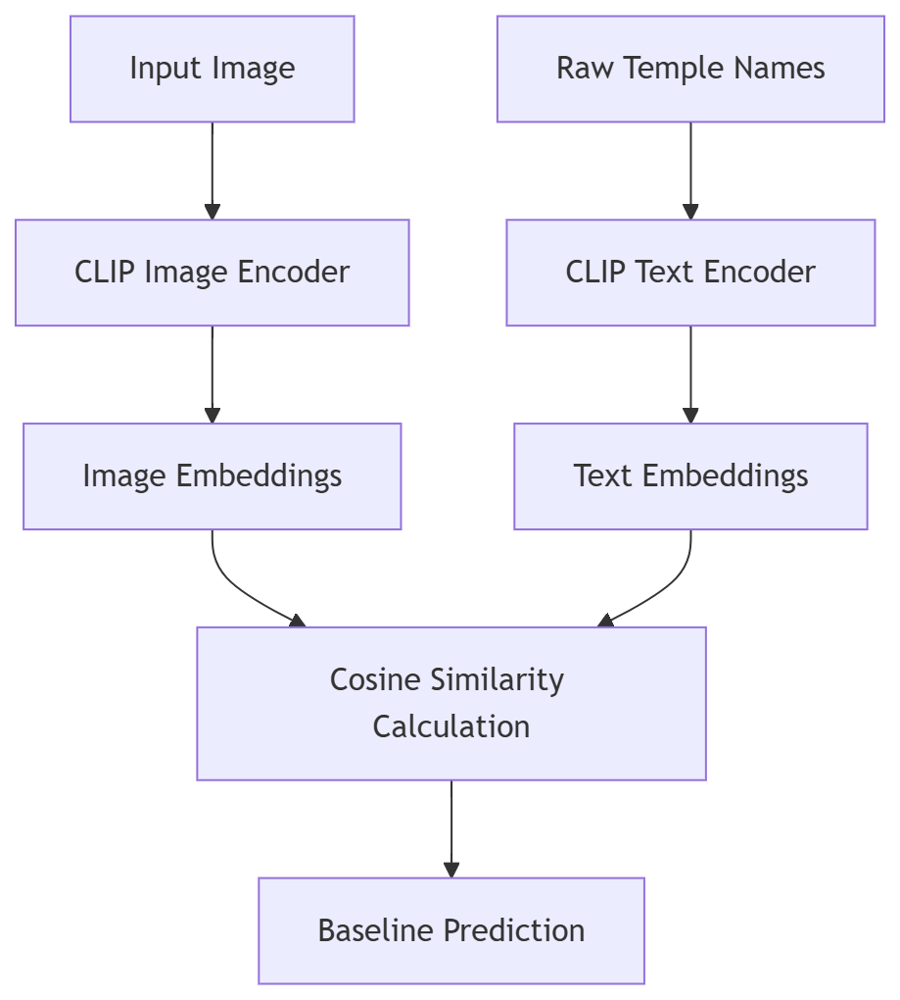
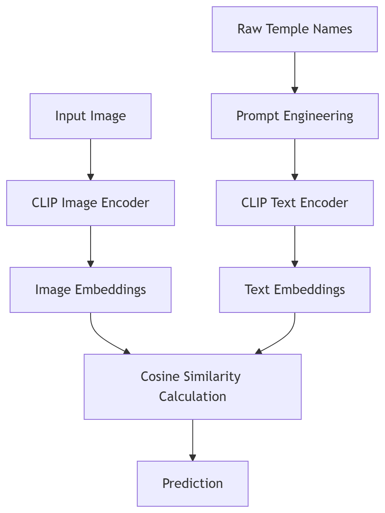
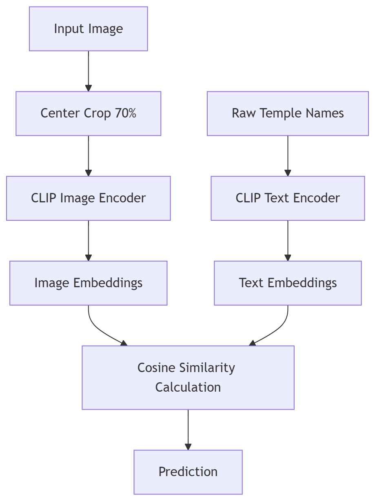
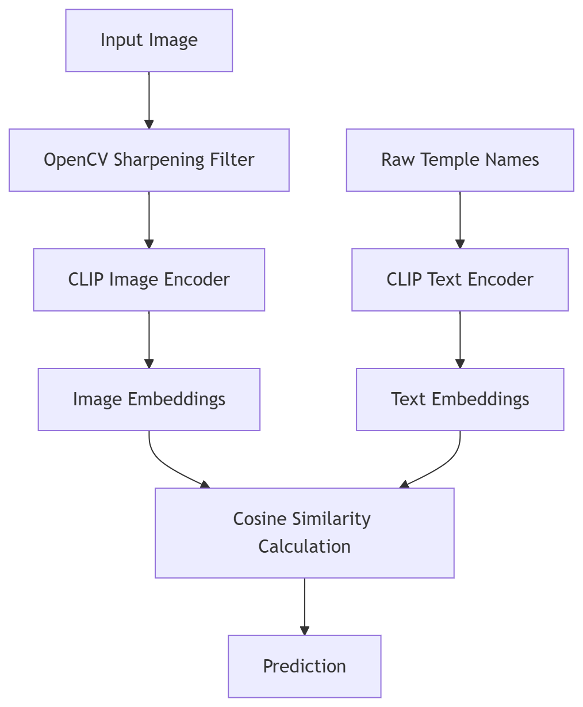
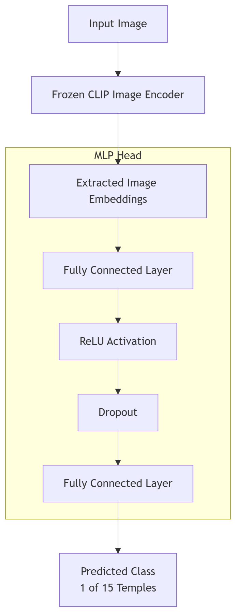

# 1. Project Overview

## 1.1 Introduction
The **Tamil Nadu Temple Detection** project aims to leverage advanced computer vision and deep learning techniques to accurately identify and classify 15 historically significant temples located in Tamil Nadu, India. These temples, many of which date back to the Sangam era, represent profound architectural, cultural, and spiritual heritage. The project provides an AI-driven solution to recognize these temples from user-uploaded images and seamlessly retrieve corresponding historical data, visiting hours, and navigation details.

## 1.2 Objective
The core objective of this application is to correctly classify an input image of a temple into one of the 15 predefined temple categories, or reject it if it is not a temple. This acts as both an educational tool and a virtual guide for tourists, historians, and architecture enthusiasts. 

## 1.3 Key Features
* **Real-time Image Classification:** Upload an image and get instant predictions.
* **Multi-Version Inference:** Choose from 5 different AI methodologies to observe the impact of varying techniques on prediction accuracy.
* **Comprehensive Metadata Retrieval:** Access historical significance, ticketing information, and Google Maps integration instantly upon classification.
* **Premium User Interface:** A carefully designed Streamlit frontend offering a responsive and aesthetically pleasing user experience.

---

# 2. Developer Details

* **Name:** Jabade Susheel Krishna
* **RollNo:** 2022101006
* **Team:** Naa Chaavu Nenu Chastha

---

# 3. Methodology & Approach

## 3.1 Dataset Preparation
The project utilizes a custom dataset (`@sample_images` in github) comprising diverse images of 15 renowned Tamil Nadu temples.

* Arunachaleswarar Temple
* Brihadeeswarar Temple
* Ekambareswarar Temple
* Jambukeswarar Temple
* Kamakshi Amman Temple
* Kapaleeshwarar Temple
* Kumari Amman Temple
* Meenakshi Amman Temple
* Palani Murugan Temple
* Ramanathaswamy Temple
* Shore Temple
* Sri Ranganathaswamy Temple
* Srivilliputhur Andal Temple
* Thillai Nataraja Temple
* Thiruchendur Murugan Temple

The images are taken from www.tripadvisor.in and they capture different locations, lighting conditions, and specific architectural motifs like Gopurams (towers), Vimanas (sanctums), and intricate corridors. The metadata for the temples are taken from the wikipedia.

## 3.2 Core Architecture
The backbone of the classification system is OpenAI's **CLIP (Contrastive Language-Image Pretraining)** model. CLIP is a state-of-the-art vision-language model trained to align images and text in a shared embedding space. By using CLIP, we sidestep the need for training a massive Convolutional Neural Network from scratch and instead leverage zero-shot classification capabilities.

## 3.3 Application Stack
* **Frontend:** Streamlit (with custom CSS for premium styling)
* **Backend:** Python, PyTorch, Transformers (Hugging Face)
* **Deployment:** Hugging Face Spaces (Dockerized)

---

# 4. Experimental Methods (The 5 Approaches)

To achieve the best accuracy, we iteratively developed 5 different prediction methodologies, each building upon the limitations of the previous one.

### V1: Baseline Zero-Shot Classification
In this initial approach, we directly passed the raw temple names as text queries to the CLIP model. The model compared the image embeddings with the text embeddings of the raw names. While straightforward, this method struggled due to the lack of context in the text prompts, yielding a baseline accuracy.

### V2: Prompt Engineering
To provide better context to the CLIP model, we engineered the text prompts. Instead of simply feeding "Meenakshi Amman Temple", we structured the prompt as: *"A majestic photo of the [Temple Name], a famous Hindu temple in Tamil Nadu, India"*. This semantic enrichment helped the model align the visual features with the conceptual understanding of a South Indian temple.

### V3: Region of Interest (ROI) Architecture Focus
Many temple images contain significant background noise (sky, crowds, surrounding city). In this method, we automatically cropped the central 70% of the image before passing it to the model. The assumption was that the core architectural motifs (like the Gopuram) are centrally framed, thus reducing the distractor elements.

### V4: Image Enhancement
Image quality plays a vital role in computer vision. We applied a sharpening filter using OpenCV to enhance the edges and structural details of the temple carvings. This pre-processing step aimed to make the intricate Dravidian architectural features more prominent for the CLIP image encoder.

### V5: Hybrid FFNN Approach (CLIP + MLP Head)
The ultimate approach involved freezing the CLIP image encoder and training a lightweight Multi-Layer Perceptron (MLP) head on top of the extracted image embeddings. The MLP consists of fully connected layers with ReLU activation and Dropout for regularization. This allowed the model to explicitly learn the decision boundaries between the 15 specific temples, drastically outperforming the zero-shot methods.

| { width=100% } | { width=100% } | { width=100% } | { width=100% } | { width=100% } |
|---|---|---|---|---|

*Fig. 1: Baseline Zero-Shot, Fig. 2: Prompt Engineering, Fig. 3: ROI Architecture Focus, Fig. 4: Image Enhancement, Fig. 5: Hybrid FFNN Approach*

### App Screenshots

.png) 
.png) 
.png)
.png) 
.png)

---

# 5. Results & Evaluation Metrics

We rigorously evaluated all 5 methods on the curated `sample_images` dataset. The primary metrics for evaluation were **Accuracy** (percentage of correct classifications) and **Average Confidence** (the mean probability score assigned to the correct class).

### Performance Table

| Method Version | Methodology Description | Accuracy | Average Confidence |
| :--- | :--- | :--- | :--- |
| **V1** | Baseline Zero-Shot | 21.78% | 32.65% |
| **V2** | Prompt Engineering | 19.80% | 33.39% |
| **V3** | ROI Architecture Focus | 11.88% | 30.16% |
| **V4** | Image Enhancement | 21.78% | 29.90% |
| **V5** | **Hybrid FFNN Approach** | **85.15%** | **62.67%** |

### Analysis
* The **Baseline (V1)** and **Image Enhancement (V4)** performed similarly in terms of zero-shot accuracy.
* **Prompt Engineering (V2)** marginally increased the confidence scores but did not significantly boost accuracy.
* **ROI Focus (V3)** performed the worst, likely because cropping removed essential contextual clues or parts of the sprawling temple complexes.
* **The Hybrid FFNN Approach (V5)** achieved a massive leap to **85.15% accuracy**, proving that while zero-shot CLIP is powerful, adding a small supervised classification head on domain-specific data yields state-of-the-art results.

---

# 6. Conclusion & Future Scope

The Tamil Nadu Temple Detection project successfully demonstrates the integration of modern foundation models (CLIP) with traditional web frameworks to create a high-impact, educational application. By systematically testing different methodologies, we proved the efficacy of hybrid architectures (V5) in fine-grained classification tasks.

**Future Enhancements:**
1. Expanding the dataset to include more temples across South India.
2. Integrating a Retrieval-Augmented Generation (RAG) system for a dynamic chatbot that can answer specific historical questions about the predicted temple.
3. Optimizing inference latency by using lighter models like MobileCLIP for edge-device deployment.

---

# 7. Project Links

* **GitHub Repository:** [https://github.com/JabadeSusheelKrishna/Tamilnadu-Temple-Detection.git](https://github.com/JabadeSusheelKrishna/Tamilnadu-Temple-Detection.git)
* **Live Application (Hugging Face Spaces):** [https://huggingface.co/spaces/SusheelKrishna/TamilNadu-Temple_Detection](https://huggingface.co/spaces/SusheelKrishna/TamilNadu-Temple_Detection)

---

*Thank You*